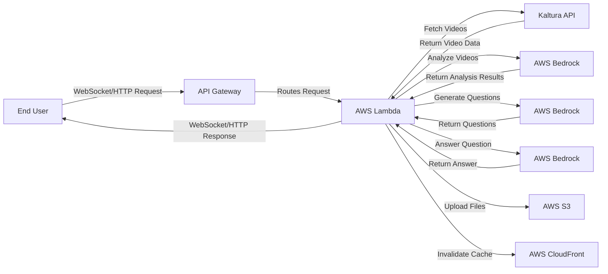

# Video Exploratorium

[](https://github.com/zoharbabin/video-exploratorium/blob/main/LICENSE)
[](https://twitter.com/zohar)

`Video Exploratorium` is an experiment project showcasing how to analyze and explore Kaltura videos using Large Language Models (LLMs). Built with AWS Lambda and Chalice, it offers a way to interact with video content through real-time analysis and a chat-based interface utilizing LLMs.  
By leveraging LLMs, this project provides detailed summaries, key insights, and interactive chat features, enhancing the way users engage with videos.  

This project makes use of AWS Bedrock APIs to interact with the Claude 3 Sonnet LLM. Thanks to the use of [`Pydantic_Prompter`](https://github.com/helmanofer/pydantic-prompter) it is very easy to switch an LLM provider. 

### Key Features

* Ability to analyze and interact across multiple videos to gain shared insights and summaries. 
* On-the-fly Video Analysis: Generate comprehensive summaries and insights from video transcripts.
* Interactive Chat: Ask questions and receive detailed answers based on video content.

### Use Cases

* Education: Enhance learning with interactive video summaries and insights.
* Market Research: Extract key messages and understand audience engagement from videos.
* Content Management: Manage large video libraries with automatic summaries and insights.

## Flow chart



### Future Expansions

Future plans include integrating interactive video experiences with cue points and layers, and combining LLM insights with real-time chat exploration during video playback.

## Requirements

- Python 3.9.13 (required by AWS Lambda, the code is compat. 3.9+)
- AWS Account with appropriate (lambda/api-gateway/bedrock/s3/cloudfront) permissions
- Kaltura Account (you'll need to provide PartnerID and KS via URL params)

## Installation

1. Clone the repository:

```bash
git clone https://github.com/zoharbabin/video-exploratorium.git
cd video-exploratorium
```

2. Create a virtual environment and activate it:

```bash
python -m venv venv
source venv/bin/activate  # On Windows, use `venv\Scripts\activate`
```

3. Install the required dependencies:

```bash
pip install -r requirements.txt
```

4. Configure AWS CLI with your credentials:

```bash
aws configure
```

## Deployment

1. Deploy the Chalice app to AWS:

```bash
chalice deploy
```

2. Upload static files to S3 and invalidate CloudFront cache:

```bash
python deploy_static.py
```

## Extending the Project

### Adding New Routes

1. Define your route in `app.py` or create a new file in `chalicelib` and import it in `app.py`.

```python
@app.route('/new-route')
def new_route():
    return {'hello': 'world'}
```

### Adding WebSocket Handlers

1. Define your WebSocket handler in `routes.py` or create a new file in `chalicelib` and import it in `routes.py`.

```python
@app.on_ws_message()
def message(event: WebsocketEvent):
    return websocket_handler(event, app)
```

### Adding Templates

1. Add your HTML template files in `chalicelib/templates`.

2. Render your templates using the `render_template` function in `app.py`.

```python
def render_template(template_name, context):
    template = template_env.get_template(template_name)
    return template.render(context)
```

### Adding Static Files

1. Add your static files in the `static` directory.

2. Deploy the static files using `deploy_static.py`.

## Contributing

Contributions are welcome! Please open an issue or submit a pull request for any improvements or bug fixes.  

## License

This project is licensed under the MIT License. See the [LICENSE](LICENSE) file for details.

## Author

- GitHub: [zoharbabin](https://github.com/zoharbabin)
- Twitter: [@zohar](https://twitter.com/zohar)
